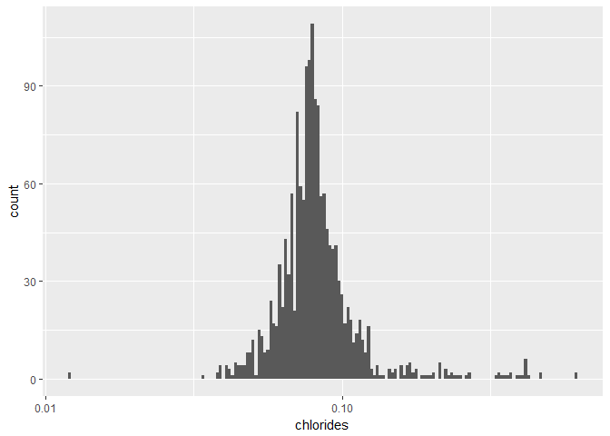

Red Wine Quality by Anthony Giustino
========================================================


This report explores a dataset of approximately 1,600 red wines with their chemical attibutes and quality.

# Univariate Plots Section


```
## [1] 1599   13
```

```
## 'data.frame':	1599 obs. of  13 variables:
##  $ X                   : int  1 2 3 4 5 6 7 8 9 10 ...
##  $ fixed.acidity       : num  7.4 7.8 7.8 11.2 7.4 7.4 7.9 7.3 7.8 7.5 ...
##  $ volatile.acidity    : num  0.7 0.88 0.76 0.28 0.7 0.66 0.6 0.65 0.58 0.5 ...
##  $ citric.acid         : num  0 0 0.04 0.56 0 0 0.06 0 0.02 0.36 ...
##  $ residual.sugar      : num  1.9 2.6 2.3 1.9 1.9 1.8 1.6 1.2 2 6.1 ...
##  $ chlorides           : num  0.076 0.098 0.092 0.075 0.076 0.075 0.069 0.065 0.073 0.071 ...
##  $ free.sulfur.dioxide : num  11 25 15 17 11 13 15 15 9 17 ...
##  $ total.sulfur.dioxide: num  34 67 54 60 34 40 59 21 18 102 ...
##  $ density             : num  0.998 0.997 0.997 0.998 0.998 ...
##  $ pH                  : num  3.51 3.2 3.26 3.16 3.51 3.51 3.3 3.39 3.36 3.35 ...
##  $ sulphates           : num  0.56 0.68 0.65 0.58 0.56 0.56 0.46 0.47 0.57 0.8 ...
##  $ alcohol             : num  9.4 9.8 9.8 9.8 9.4 9.4 9.4 10 9.5 10.5 ...
##  $ quality             : int  5 5 5 6 5 5 5 7 7 5 ...
```

```
##        X          fixed.acidity   volatile.acidity  citric.acid   
##  Min.   :   1.0   Min.   : 4.60   Min.   :0.1200   Min.   :0.000  
##  1st Qu.: 400.5   1st Qu.: 7.10   1st Qu.:0.3900   1st Qu.:0.090  
##  Median : 800.0   Median : 7.90   Median :0.5200   Median :0.260  
##  Mean   : 800.0   Mean   : 8.32   Mean   :0.5278   Mean   :0.271  
##  3rd Qu.:1199.5   3rd Qu.: 9.20   3rd Qu.:0.6400   3rd Qu.:0.420  
##  Max.   :1599.0   Max.   :15.90   Max.   :1.5800   Max.   :1.000  
##  residual.sugar     chlorides       free.sulfur.dioxide
##  Min.   : 0.900   Min.   :0.01200   Min.   : 1.00      
##  1st Qu.: 1.900   1st Qu.:0.07000   1st Qu.: 7.00      
##  Median : 2.200   Median :0.07900   Median :14.00      
##  Mean   : 2.539   Mean   :0.08747   Mean   :15.87      
##  3rd Qu.: 2.600   3rd Qu.:0.09000   3rd Qu.:21.00      
##  Max.   :15.500   Max.   :0.61100   Max.   :72.00      
##  total.sulfur.dioxide    density             pH          sulphates     
##  Min.   :  6.00       Min.   :0.9901   Min.   :2.740   Min.   :0.3300  
##  1st Qu.: 22.00       1st Qu.:0.9956   1st Qu.:3.210   1st Qu.:0.5500  
##  Median : 38.00       Median :0.9968   Median :3.310   Median :0.6200  
##  Mean   : 46.47       Mean   :0.9967   Mean   :3.311   Mean   :0.6581  
##  3rd Qu.: 62.00       3rd Qu.:0.9978   3rd Qu.:3.400   3rd Qu.:0.7300  
##  Max.   :289.00       Max.   :1.0037   Max.   :4.010   Max.   :2.0000  
##     alcohol         quality     
##  Min.   : 8.40   Min.   :3.000  
##  1st Qu.: 9.50   1st Qu.:5.000  
##  Median :10.20   Median :6.000  
##  Mean   :10.42   Mean   :5.636  
##  3rd Qu.:11.10   3rd Qu.:6.000  
##  Max.   :14.90   Max.   :8.000
```
The wine dataset consists of 13 vaariables for about 1,600 wines.

<!-- -->

Wine quality ratings range from a minimum of 3 to a maximum of 8 with most ratings falling between 5 and 6. The other variables such as alcohol, sulphates, PH, etc. are either normally distributed or skewed to the right. This analysis will expolore the relationship between these variables and quality to determine what characteristics have a significant impact on quality rating.

Let's explore the individual variables a little more in depth.


<!-- -->

```
##    Min. 1st Qu.  Median    Mean 3rd Qu.    Max. 
##    8.40    9.50   10.20   10.42   11.10   14.90
```

Most red wines in this dataset have a modest ABV between 9.5% and 11%. The data is distributed normally.

<!-- -->

```
##    Min. 1st Qu.  Median    Mean 3rd Qu.    Max. 
##  0.3300  0.5500  0.6200  0.6581  0.7300  2.0000
```

Sulfates, which act as an anitimicrobial and antioxidant are normally distributed with most levels falling between 0.5 and 0.7 g/dm3. There are a few outliers that are above 1.5 up to 2 g/dm3.

<!-- -->

```
##    Min. 1st Qu.  Median    Mean 3rd Qu.    Max. 
##   2.740   3.210   3.310   3.311   3.400   4.010
```

pH levels which measure the acidity level of wine usually fall between 3.1 and 3.5. pH measurments range from 0 (very acidic) to 14 (very basic), so red wines are moderately acidic beverages. The most acid red wine has a pH of 2.7 while the most basic wine has a pH level of 4. Given the 14 point pH scale, the minimum of 2.7 and max of 4 seems like a relatively narrow spectrum red wines fall within.

<!-- -->

```
##    Min. 1st Qu.  Median    Mean 3rd Qu.    Max. 
##  0.9901  0.9956  0.9968  0.9967  0.9978  1.0037
```

The density of wine is usually close to water (1 g/cm^3) depending on sugar and alcohol levels. It seems like the sample of 1,599 red wines in this dataset are well balanced when it comes to residual sugar and alcohol content as the minimum density is 0.9901 g/cm^3 and the max is 1.0037 g/cm^3. Nevertheless, it will be interesting to explore the relationship between density, residual sugar, alcohol and quality.

<!-- -->

```
##    Min. 1st Qu.  Median    Mean 3rd Qu.    Max. 
##    6.00   22.00   38.00   46.47   62.00  289.00
```

```
##    Mode   FALSE    TRUE 
## logical    1053     546
```

It's not surprising the SO2 readings are skewed to the left since SO2 levels above 50 ppm can be detected in the nose and taste of wine, which may be undesirable. However, 546 (34%) of the red wines in this dataset have a SO2 level above 50 ppm. It will be interesting to see where this population of wines falls in the quality rating. Is a high SO2 level desirable (in terms of quality rating)? What other characteristics, if any, coupled with high SO2 may attribute to a high quality wine?

<!-- -->

```
##    Min. 1st Qu.  Median    Mean 3rd Qu.    Max. 
##    1.00    7.00   14.00   15.87   21.00   72.00
```

prevents microbial growth and the oxidation of wine

<!-- --><!-- -->

```
##    Min. 1st Qu.  Median    Mean 3rd Qu.    Max. 
## 0.01200 0.07000 0.07900 0.08747 0.09000 0.61100
```

The amount of salt in wine is normally distributed with a few outliers on the low and high end.

<!-- --><!-- -->

```
##    Min. 1st Qu.  Median    Mean 3rd Qu.    Max. 
##   0.900   1.900   2.200   2.539   2.600  15.500
```

The sample of 1,599 red wines looks to be on the drier side as none have a sugar content above 15.5 g/dm^3. In fact, the middle 50% of wines fall between 1.9 and 2.6 (quite dry). Wines with greater than 45 g/dm^3 are considered sweet.

<!-- -->

```
##    Min. 1st Qu.  Median    Mean 3rd Qu.    Max. 
##   0.000   0.090   0.260   0.271   0.420   1.000
```

```
##    Mode   FALSE    TRUE 
## logical    1467     132
```

Citric acid can add 'freshness' and flavor to wines. This flavor profile is more prominent in white wines so I did not expect the citric acid levels to be very high in the red wine dataset. None of the red wines had a citric acid level above 1 g/dm^3. In fact, 0.0 g/dm^3 is the highest occurance (132 observations).

<!-- -->

```
##    Min. 1st Qu.  Median    Mean 3rd Qu.    Max. 
##  0.1200  0.3900  0.5200  0.5278  0.6400  1.5800
```

```
##    Mode   FALSE    TRUE 
## logical    1598       1
```

```
##    Mode   FALSE    TRUE 
## logical    1576      23
```

High of levels (above 1.4 g/dm^3 per the Code of Federal Regulations) can lead to an unpleasant, vinegar taste. Only one wine in this dataset is above the acceptable volatile acidity level. There are 23 wines falling between 1 and 1.4. I wonder how these wines will fare in quality.

<!-- -->

```
##    Min. 1st Qu.  Median    Mean 3rd Qu.    Max. 
##    4.60    7.10    7.90    8.32    9.20   15.90
```

Most wines fall between 7 and 9 g/md^3. This mesurment will be observed with pH to get a better understanding of the acidity level and what level is correlated to a high quality rating.


# Univariate Analysis

### What is the structure of your dataset?
There are 1,599 red wine observations with 12 variables:
   1 - fixed acidity (tartaric acid - g / dm^3)
   2 - volatile acidity (acetic acid - g / dm^3)
   3 - citric acid (g / dm^3)
   4 - residual sugar (g / dm^3)
   5 - chlorides (sodium chloride - g / dm^3
   6 - free sulfur dioxide (mg / dm^3)
   7 - total sulfur dioxide (mg / dm^3)
   8 - density (g / cm^3)
   9 - pH
   10 - sulphates (potassium sulphate - g / dm3)
   11 - alcohol (% by volume)
   Output variable (based on sensory data): 
   12 - quality (score between 0 and 10)
   
All variables are either integers or number (float).

### What is/are the main feature(s) of interest in your dataset?
The main feature of this dataset is the Quality of red wine and how chemical characteristics (mainly alcohol, pH, and total sulfer dioxide) may contribute to the quality score. The ultimate goal is to determine what chemical characteristics are present in the highest quality red wines.

### What other features in the dataset do you think will help support your \
investigation into your feature(s) of interest?
Other variables that will be explored are sulphates, density, chlorides, residual sugar, and volatile acidity.

### Did you create any new variables from existing variables in the dataset?
No new variables were created at this point.

### Of the features you investigated, were there any unusual distributions? \
Did you perform any operations on the data to tidy, adjust, or change the form \
of the data? If so, why did you do this?
I few variables (chlorides and residual sugar) were skewed to the left so I log-transformed to better visualize the frequency. The left-skewed chloride and residual sugar data looks more normally distributed once log-transformed.

I also adjusted the binwidths and x-axis limits and breaks to make the plots more readable.


# Bivariate Plots Section


                        fixed.acidity   volatile.acidity   citric.acid   residual.sugar    chlorides   free.sulfur.dioxide   total.sulfur.dioxide      density           pH    sulphates      alcohol      quality
---------------------  --------------  -----------------  ------------  ---------------  -----------  --------------------  ---------------------  -----------  -----------  -----------  -----------  -----------
fixed.acidity               1.0000000         -0.2561309     0.6717034        0.1147767    0.0937052            -0.1537942             -0.1131814    0.6680473   -0.6829782    0.1830057   -0.0616683    0.1240516
volatile.acidity           -0.2561309          1.0000000    -0.5524957        0.0019179    0.0612978            -0.0105038              0.0764700    0.0220262    0.2349373   -0.2609867   -0.2022880   -0.3905578
citric.acid                 0.6717034         -0.5524957     1.0000000        0.1435772    0.2038229            -0.0609781              0.0355330    0.3649472   -0.5419041    0.3127700    0.1099032    0.2263725
residual.sugar              0.1147767          0.0019179     0.1435772        1.0000000    0.0556095             0.1870490              0.2030279    0.3552834   -0.0856524    0.0055271    0.0420754    0.0137316
chlorides                   0.0937052          0.0612978     0.2038229        0.0556095    1.0000000             0.0055621              0.0474005    0.2006323   -0.2650261    0.3712605   -0.2211405   -0.1289066
free.sulfur.dioxide        -0.1537942         -0.0105038    -0.0609781        0.1870490    0.0055621             1.0000000              0.6676665   -0.0219458    0.0703775    0.0516576   -0.0694084   -0.0506561
total.sulfur.dioxide       -0.1131814          0.0764700     0.0355330        0.2030279    0.0474005             0.6676665              1.0000000    0.0712695   -0.0664946    0.0429468   -0.2056539   -0.1851003
density                     0.6680473          0.0220262     0.3649472        0.3552834    0.2006323            -0.0219458              0.0712695    1.0000000   -0.3416993    0.1485064   -0.4961798   -0.1749192
pH                         -0.6829782          0.2349373    -0.5419041       -0.0856524   -0.2650261             0.0703775             -0.0664946   -0.3416993    1.0000000   -0.1966476    0.2056325   -0.0577314
sulphates                   0.1830057         -0.2609867     0.3127700        0.0055271    0.3712605             0.0516576              0.0429468    0.1485064   -0.1966476    1.0000000    0.0935948    0.2513971
alcohol                    -0.0616683         -0.2022880     0.1099032        0.0420754   -0.2211405            -0.0694084             -0.2056539   -0.4961798    0.2056325    0.0935948    1.0000000    0.4761663
quality                     0.1240516         -0.3905578     0.2263725        0.0137316   -0.1289066            -0.0506561             -0.1851003   -0.1749192   -0.0577314    0.2513971    0.4761663    1.0000000

<!-- -->

There doesn't seem to be any glaring strong correlations between the chemical variables and quality. The strongest correlations lie within alcohol (0.476) and volatile acidity (-0.391).

Below are some notable inter-varialbe correlations:

  * fixed acidity vs. density                     = 0.668  
  * citric acid vs. density                       = 0.365  
  * residual sugar vs. density                    = 0.355  
  * fixed acidity vs. pH                          = -0.683  
  * fixed acidity vs. citric acid                 = 0.672  
  * volatile acidity vs. citric acid              = -0.552  
  * pH vs. citric acid                            = -0.542  
  * total sulfur dioxide vs. free sulfer dioxide  = 0.668
  
<!-- --><!-- -->

```
## 
## Call:
## lm(formula = quality ~ alcohol, data = wine)
## 
## Residuals:
##     Min      1Q  Median      3Q     Max 
## -2.8442 -0.4112 -0.1690  0.5166  2.5888 
## 
## Coefficients:
##             Estimate Std. Error t value Pr(>|t|)    
## (Intercept)  1.87497    0.17471   10.73   <2e-16 ***
## alcohol      0.36084    0.01668   21.64   <2e-16 ***
## ---
## Signif. codes:  0 '***' 0.001 '**' 0.01 '*' 0.05 '.' 0.1 ' ' 1
## 
## Residual standard error: 0.7104 on 1597 degrees of freedom
## Multiple R-squared:  0.2267,	Adjusted R-squared:  0.2263 
## F-statistic: 468.3 on 1 and 1597 DF,  p-value: < 2.2e-16
```

I transformed the quality vs. alcohol plot to include some transparancy and jitter for the top 99% of alcohol readings. This gives us a better representation of the relationship between quality and alcohol, which looks to be mostestly positive. Though there is a presence of a positive relationship, it seems like only 23 percent of the quality variance can be attributed to strictly alcohol.

<!-- --><!-- -->

```
## 
## Call:
## lm(formula = quality ~ volatile.acidity, data = wine)
## 
## Residuals:
##      Min       1Q   Median       3Q      Max 
## -2.79071 -0.54411 -0.00687  0.47350  2.93148 
## 
## Coefficients:
##                  Estimate Std. Error t value Pr(>|t|)    
## (Intercept)       6.56575    0.05791  113.39   <2e-16 ***
## volatile.acidity -1.76144    0.10389  -16.95   <2e-16 ***
## ---
## Signif. codes:  0 '***' 0.001 '**' 0.01 '*' 0.05 '.' 0.1 ' ' 1
## 
## Residual standard error: 0.7437 on 1597 degrees of freedom
## Multiple R-squared:  0.1525,	Adjusted R-squared:  0.152 
## F-statistic: 287.4 on 1 and 1597 DF,  p-value: < 2.2e-16
```

I applied the same transformations from the alcohol vs. quality plot to  the volatile acidity vs. quality plot and it looks like there is a slightly negative correlation. Unfortunately, this relationship explains even less of the variance in quality ratings - only 15 percent.


What now? The two individual variables (alcohol and volatile acidity) that had the highest correlation to quality did not have very high R^2 values. I will try adding more supporting variables to the model in an attempt explain more of the quality variance.


```
## 
## Calls:
## m1: lm(formula = quality ~ alcohol, data = wine)
## m2: lm(formula = quality ~ alcohol + fixed.acidity, data = wine)
## m3: lm(formula = quality ~ alcohol + fixed.acidity + citric.acid, 
##     data = wine)
## m4: lm(formula = quality ~ alcohol + fixed.acidity + citric.acid + 
##     sulphates, data = wine)
## m5: lm(formula = quality ~ alcohol + fixed.acidity + citric.acid + 
##     sulphates + volatile.acidity, data = wine)
## m6: lm(formula = quality ~ alcohol + fixed.acidity + citric.acid + 
##     sulphates + volatile.acidity + total.sulfur.dioxide, data = wine)
## m7: lm(formula = quality ~ alcohol + fixed.acidity + citric.acid + 
##     sulphates + volatile.acidity + total.sulfur.dioxide + density, 
##     data = wine)
## 
## ==========================================================================================================================
##                              m1            m2            m3            m4            m5            m6            m7       
## --------------------------------------------------------------------------------------------------------------------------
##   (Intercept)               1.875***      1.206***      1.563***      1.138***      2.202***      2.448***     27.297     
##                            (0.175)       (0.196)       (0.211)       (0.214)       (0.224)       (0.235)      (15.148)    
##   alcohol                   0.361***      0.368***      0.353***      0.346***      0.320***      0.307***      0.288***  
##                            (0.017)       (0.016)       (0.017)       (0.016)       (0.016)       (0.016)       (0.020)    
##   fixed.acidity                           0.071***      0.030*        0.033*        0.057***      0.046***      0.063***  
##                                          (0.010)       (0.014)       (0.013)       (0.013)       (0.013)       (0.017)    
##   citric.acid                                           0.548***      0.312*       -0.469***     -0.362**      -0.358*    
##                                                        (0.123)       (0.125)       (0.137)       (0.140)       (0.140)    
##   sulphates                                                           0.821***      0.701***      0.720***      0.747***  
##                                                                      (0.106)       (0.103)       (0.102)       (0.104)    
##   volatile.acidity                                                                 -1.343***     -1.293***     -1.258***  
##                                                                                    (0.113)       (0.114)       (0.116)    
##   total.sulfur.dioxide                                                                           -0.002***     -0.002**   
##                                                                                                  (0.001)       (0.001)    
##   density                                                                                                     -24.918     
##                                                                                                               (15.188)    
## --------------------------------------------------------------------------------------------------------------------------
##   R-squared                 0.227         0.250         0.260         0.286         0.344         0.349         0.350     
##   adj. R-squared            0.226         0.249         0.258         0.284         0.342         0.346         0.347     
##   sigma                     0.710         0.700         0.696         0.683         0.655         0.653         0.653     
##   F                       468.267       266.512       186.376       159.804       167.023       141.961       122.194     
##   p                         0.000         0.000         0.000         0.000         0.000         0.000         0.000     
##   Log-likelihood        -1721.057     -1696.248     -1686.375     -1657.046     -1589.648     -1584.010     -1582.658     
##   Deviance                805.870       781.248       771.660       743.865       683.728       678.923       677.776     
##   AIC                    3448.114      3400.496      3382.750      3326.091      3193.297      3184.019      3183.316     
##   BIC                    3464.245      3422.004      3409.636      3358.354      3230.937      3227.036      3231.711     
##   N                      1599          1599          1599          1599          1599          1599          1599         
## ==========================================================================================================================
```

Even with adding more variables to the model, there is not much of an improvment in R^2 value. Residual sugar, chlorides, free sulfur dioxide, and pH were left off the model due to their observed very low correlation to quality. Maybe exploring how some individual variables are related to each other will help in this analysis.

<!-- -->

```
##    Min. 1st Qu.  Median    Mean 3rd Qu.    Max. 
##    8.40    9.50   10.20   10.42   11.10   14.90
```

```
##    Min. 1st Qu.  Median    Mean 3rd Qu.    Max. 
##  0.9901  0.9956  0.9968  0.9967  0.9978  1.0037
```

<!-- -->

Density has the highest (negative) correlation to alcohol at -0.496 - in general, as alcohol levels increase, density decreases. Since there is a relatively strong correlation between fixed acidity, citric acid, and residual sugar to density (0.668, 0.365, 0.355 respectively), one may want to draw a hypothesis that as alcohol levels increase, fixed acidity, citric acid, and residual sugar levels will decrease. And given the positive correlation between alcohol and quality (0.476), one may also want to draw a hypothesis that a red wine's quality and alcohol level would be affected positively or negatively based on the levels of density, fixed acidity, citric acid, and residual sugar. Unfortunately, these hypthesis don't seem to hold up well when observing the relationships between density, fixed acidity, citric acid, and residual sugar directly to quality. The correlation for these variables against quality are very weak or slightly inverse of what was hypothesised when observing the correlation table above.

Due to the lack of a strong correlation between any one variable to quality and the lack of correlation between any individual variable to another, I am left to believe that no one variable or group of variables has a large impact on the quality of red wine.


# Bivariate Analysis

### Talk about some of the relationships you observed in this part of the \
investigation. How did the feature(s) of interest vary with other features in \
the dataset?

When exploring if multiple correlated individual variables could be combined into groups, it was discovered that no individual variable has a correlation stronger than |0.683| (fixed acidity vs. pH). This leads me to believe that no one variable or group of variables has a large impact on the quality of red wine.

### Did you observe any interesting relationships between the other features \
(not the main feature(s) of interest)?

Though there was some level of correlation between certain variables, I feel none of the correlations were strong enough to formulate a hypothesis confidently.

### What was the strongest relationship you found?

The stongest relationship found was between fixed acidity and pH (-0.683).


# Multivariate Plots Section


```
## 'data.frame':	1599 obs. of  17 variables:
##  $ X                      : int  1 2 3 4 5 6 7 8 9 10 ...
##  $ fixed.acidity          : num  7.4 7.8 7.8 11.2 7.4 7.4 7.9 7.3 7.8 7.5 ...
##  $ volatile.acidity       : num  0.7 0.88 0.76 0.28 0.7 0.66 0.6 0.65 0.58 0.5 ...
##  $ citric.acid            : num  0 0 0.04 0.56 0 0 0.06 0 0.02 0.36 ...
##  $ residual.sugar         : num  1.9 2.6 2.3 1.9 1.9 1.8 1.6 1.2 2 6.1 ...
##  $ chlorides              : num  0.076 0.098 0.092 0.075 0.076 0.075 0.069 0.065 0.073 0.071 ...
##  $ free.sulfur.dioxide    : num  11 25 15 17 11 13 15 15 9 17 ...
##  $ total.sulfur.dioxide   : num  34 67 54 60 34 40 59 21 18 102 ...
##  $ density                : num  0.998 0.997 0.997 0.998 0.998 ...
##  $ pH                     : num  3.51 3.2 3.26 3.16 3.51 3.51 3.3 3.39 3.36 3.35 ...
##  $ sulphates              : num  0.56 0.68 0.65 0.58 0.56 0.56 0.46 0.47 0.57 0.8 ...
##  $ alcohol                : num  9.4 9.8 9.8 9.8 9.4 9.4 9.4 10 9.5 10.5 ...
##  $ quality                : int  5 5 5 6 5 5 5 7 7 5 ...
##  $ quality.factor         : Factor w/ 6 levels "3","4","5","6",..: 3 3 3 4 3 3 3 5 5 3 ...
##  $ alcohol.bucket         : Factor w/ 7 levels "(8,9]","(9,10]",..: 2 2 2 2 2 2 2 2 2 3 ...
##  $ density.bucket         : Factor w/ 8 levels "(0.99,0.9925]",..: 4 3 3 4 4 4 3 2 3 4 ...
##  $ volatile.acidity.bucket: Factor w/ 6 levels "(0.1,0.35]","(0.35,0.6]",..: 3 4 3 1 3 3 2 3 2 2 ...
```

<!-- -->

This density plot by alcohol content shows that the data points are clustered by the quality rating. Most red wines with a quality rating of 5 have a density between 1 and 0.995 and an alcohol content mostly between 8 - 10 percent. The density of wines with a quality of 6 is more concentrated between 0.9975 and 0.9925 with alcohol percent increasing. Wines with a quality rating of 7+ mostly have a density around 0.995 and lower with most alcohol levels higher than 11 percent.

<!-- -->

The same banding that was observed above is also present in this density plot by volatile acidity content plot. It is clear that the higher quality wines (7 - 8) have a lower relative volatile acidity level - mostly  under 0.6.


# Multivariate Analysis

### Talk about some of the relationships you observed in this part of the \
investigation. Were there features that strengthened each other in terms of \
looking at your feature(s) of interest?

Due to the lack of inter-variable correlations, it was a little difficult to formulate plots with the goal of spotting trends. The plots I did make show a fairly clear relationship that alcohol, density and volatile acidity have on quality of red wine.

### Were there any interesting or surprising interactions between features?

The relationships betweetn variables were mostly as I anticipated, however, I did not expect these variables to have such a weak overall correcation to each other and the quality of red wines. It seems to me that the rating for a red wine is largely subjective to the person who is doing the rating and what their preferences are. A possible reason for the weak correlations is that this dataset does not distiguish the different styles and flavor profiles of red wine (merlot, cabernet, etc.). 

### OPTIONAL: Did you create any models with your dataset? Discuss the \
strengths and limitations of your model.

------

# Final Plots and Summary

### Plot One
<!-- -->

### Description One

This is a histogram of quality ratings in the red wine dataset. It is very clear that most wines have a modest rating between 5-6 on a scale from 1 to 10. With a maximum rating of 8 in the dataset, my focus will be on the wines rated 7 or higher.

### Plot Two
<!-- -->

### Description Two

Since alcohol volume had the strongest correlation to quality (0.476) I immediately wanted to visualize this relationship. Though you can't say that alcohol % volume is the cause of good wine, you could see in the plot that higher rated wine (7 -8) tend to have higher alcohol % volume.

### Plot Three
<!-- -->

### Description Three

Since multiple individual variables (fixed acidity, citric acid, residual sugar) seem to be correlated to density, I was interested in plotting the relationship to quality. This plot reinforces the hypothesis that higher quality wine tends to have a higher alcohol content but also shows that as quality increased, density usually decreased.

------

# Reflection

The red wine dataset contains 1,599 observations of 13 variables. When I started this analysis, I expected to be able to confidently point out what chemical characteristics make the best quality wine. After the analysis, I have an idea of what makes good wine but by no means do I think I could make a blanket statment as to what variables contribute to a good wine.

Off of the intial analysis, I saw that there was a modest correlation between quality and alcohol % volume but that was about it. It doesn't seem like there is a stong correlation between any one variable and quality or any one variable to another variable for that matter. The strongest inter-variable correlation was -0.683 between fixed acitidy and pH, but when comparing pH to quality (the main feature of this analysis) there was a very week correlation of only -0.058. The lack of correlation (positive or negative) between all variables made it difficult to draw hypothesis' as to what chemical characteristics contributed to high quality wine.

I believe part of the struggle I encountered with this analysis was due to not have the wines characterized by style (merlot, cabernet, etc.). Since each of these different styles have different flavor profiles, certain chemical characteristics would be favored over other. Since this dataset did not specify the red wine styles, I feel like the data became 'diluted'.

An idea for future work on the dataset would be to group the individual variables into different broader categories (ie. Acidity, Sulfer, etc.) and explore the relationships between these categories and quality. I believe doing this analysis at a higher level may yield stronger correlations.
